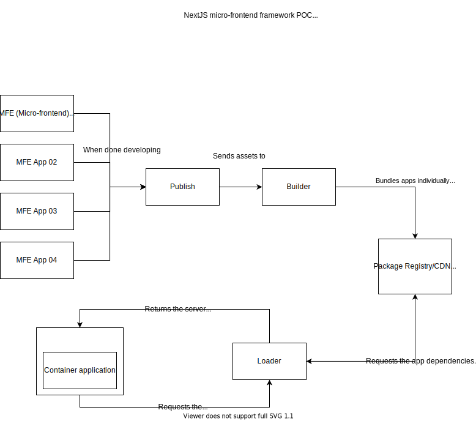

# NextJS microfrontend framework with run-time integration approach

- [NextJS microfrontend framework with run-time integration approach](#nextjs-microfrontend-framework-with-run-time-integration-approach)
  - [Strenghts](#strenghts)
  - [Weaknesses](#weaknesses)
  - [Playing with the POC](#playing-with-the-poc)
  - [Architecture](#architecture)
    - [Interaction Overview](#interaction-overview)

## Strenghts

- Each microfrontend can be deployed independently.

## Weaknesses

- Client-side rendering is not an option.

## Playing with the POC

Unfortunatelly, you can't play with this POC unless you configure your own Vercel instance to take care of the deployments of the micro-frontend applications. That is because I didn't implement a programmatic deployment workflow for this POC (too much effort for a POC).

## Architecture

### Interaction Overview

